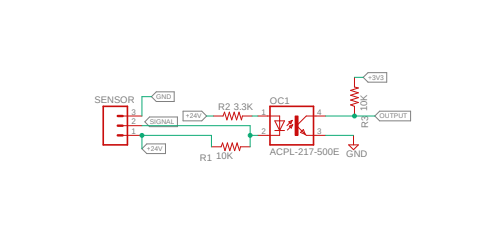
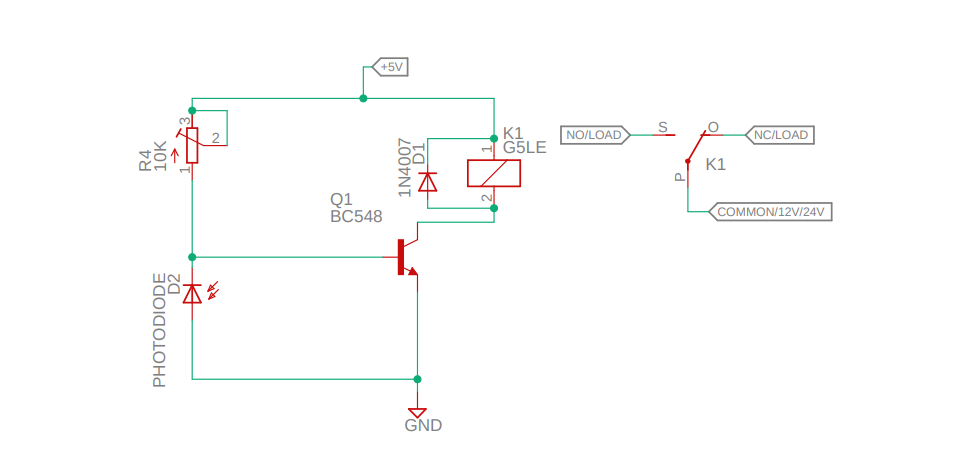
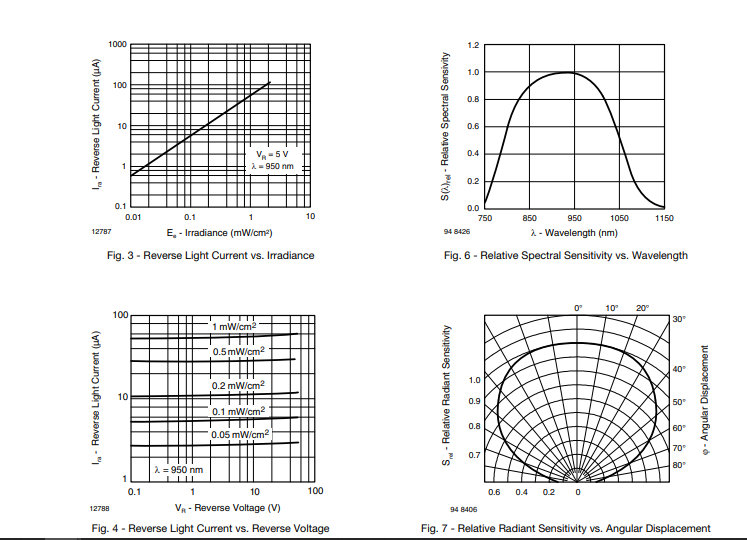

# Dilshad_System-Engg_Angel-

- [Assignment](#assignment)
    - [Task1](#task1)
        - [Solution](#solution)
        - [Parts Used](#parts-used)
        - [Solution Diagram](#solution-diagram)
        - [Design](#design)
        - [Working](#working)
        
    - [Task2](#task2)
        - [Solution_2](#solution_2)
        - [Parts Used_2](#parts-used_2)
        - [Solution Diagram_2](#solution-diagram_2)
        - [Design_2](#design_2)
        - [Working_2](#working_2)
        
# Assignment

## Task1 
* `Design a circuit for interfacing 24v operating sensor's (any sensor you may choose analog/digital) output to 5v operating microcontroller's an input/GPIO pin (any controller you may choose) and also explain your approach for the same`

### **Solution** 

> ### *Parts Used*
  > > * [STM32F407VGT6](https://www.st.com/resource/en/datasheet/dm00037051.pdf)
  > > * [Proximity Sensor](https://www.sick.com/in/en/inductive-proximity-sensors/inductive-proximity-sensors/ime/ime12-04nnszc0s/p/p228444)
  > > * [Optocoupler](https://www.mouser.com/datasheet/2/38/AV02-0470EN-189984.pdf)
  > > * Generic resistors
  
> #### 
  
> #### *Design*

> > * `Optocupler`
> > >  * `Calculating R2` : As given in [datasheet]((https://www.mouser.com/datasheet/2/38/AV02-0470EN-189984.pdf)).
Given that `CTR`:50% (min) at IF = 5mA, average Forward Current `IF(AVG)` is 50 mA with forward voltage drop of `1.2 V`, so we have to place 
        some current limiting resistor R1 can be calculated ( considering the forward current  of 7mA across the Anode Cathode terminal ) as  -
        `R2 = ( Vs - Vf) / If` => R2 = (24v - 1.2V)/7mA = 3.257 K Ohm ( a common value of 3.3 K Ohm can be selected )
    
 > > > * `Calculating R1`: Here R2 is a pull-up resistor for sensor signal, and a general thumb of rule is for resistive sensor applications, the typical pull-up resistor value can be 1-10 kΩ. So a value of 10 K at 24V will allow a current of 2.4mA that is a nice value for a 1/8 or 1/16 watt resistor.
    
 > > > * `Calculating R1`: Here R3 is the pull on the controller side since the logic level of the controller is 3.3v we can easily place a resistor of value between 1K to 10K. So we can select a value of 10 K ohm. If high current is passed through optocupler it will reduce its life cycle.
    
 > > * `Proximity Sensor`: It can operate on any voltage between a range of 10V to 30V and its output will be the same as its input voltage. 
   
 > > * 'Micro-controller` : It supports 3.3v logic level so the optocupler is configured for the same.

> ### *Working*
  > > * As soon as a metal is brought under the sensing range of the Proximity sensor (Safe sensing range Sa 3.24 mm) the output will be set to `zero` which will complete the 
  `optocoupler` circuit, causing photodiode to emit photons which will trigger the base of transistor causing it to change the output level. This change can be read from MCU either by polling on it or by interrupt (provided pin is configured for receiving interrupts).
  
##  Task2
* `Design an IR sensor-based (without using microcontroller) circuit operating on 5V to trigger or control[on/off] an 12v/24v output device (motor/relay e.t.c). And also explain your approach for the same`.

### Solution_2 
> ### *Parts Used*
  > > * [Photo Diode](https://www.vishay.com/docs/84658/temd5110.pdf) 
  > > * [Relay](https://omronfs.omron.com/en_US/ecb/products/pdf/en-g5le.pdf)
  > > * Generic resistors/Potentiometer
  > > * Generic Transistor
  
> #### 
  
> ### *Design_2*
  > > * Silicon PIN Photodiode is used for IR detector as it has an `Angle of half sensitivity` = `+-(65) degree` and is the sensitive for rays having `wavelength of 750nm to 1150 nm` 
  ( wavelength of InfraRed spectrum lies between approx. `700nm to 1000nm` ).
  > > * 
  > > * Relay G5LE-1 DC5 is used having `Coil Voltage` = `5 v` and `Switching Voltage` : `277 VAC, 30 VDC ` 
  
> ### *Working_2*
  > > * Here a photodiode is used to sense the light. The photodiode offers a high resistance when there is no light falling on it.
  > > * Here the photodiode is connected in `reverse-biased` condition.The only current flowing through it will be due to the minority carriers.
  > > * R1 (Potentiometer) can be used to `adjust the sensitivity` of the circuit.
  > > * When IR light falls on it, the current due to the minority carriers increases and the diode offers low resistance.
  > > * As a result the voltage across the diode will not be sufficient to make the transistor Q1 forward biased and the `relay will OFF`.
  > > * When there occur IR light the photodiode resistance increases and the voltage across it will become enough to forward bias the transistor Q1 making the `relay ON`.
  > > * The diode D2 is used as a freewheeling diode to protect the transistor from `transients` (short-lived burst of energy in a system caused by a sudden change of state) produced to the switching of relay.
  > > * By this way the load connected through the relay contacts can be switched ON and OFF according to the light falling on the photodiode.
